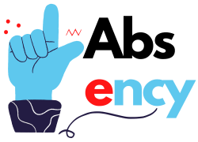

# Absency

   

## About us

Absency is an interface application for employees to calculate attendance and payroll simply with Reactjs as the Front-end and GO as the Backend.

## Technology

| Name  | Version |
| ------------- | ------------- |
| NodeJS  | `v16.13.0`  |
| ReactJS  | `v17.0.2`  |
| GO  | `v1.17.3`  |

## Development

## Notes

## Features

## Documentation
Documentation Area.
Data.
